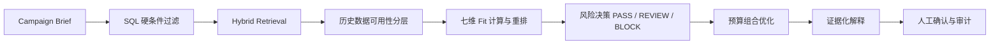

# MatchBridge 智选

> An explainable creator-selection agent that turns a Campaign Brief into a risk-aware, budget-optimized creator portfolio with a human approval loop.

[](https://github.com/chloegao7376/matchbridge-creator-selection-agent/actions/workflows/ci.yml)


**[在线体验 MatchBridge 智选](https://chloegao7376.github.io/matchbridge-creator-selection-agent/)** · [查看 API 与算法文档](docs/)

MatchBridge 智选面向品牌营销团队，将品类、预算、目标人群、平台和调性等 Campaign Brief 转化为可执行的达人组合。系统不是单纯按“最高分”选号，而是在准入约束、内容与受众适配、风险判断、预期主 KPI、报价和组合受众重叠之间做显式权衡，并保留人工锁定、排除、复核与最终确认记录。


## 项目亮点

- **多阶段推荐链路**：SQL 硬条件过滤、关键词与语义混合召回、七维 Fit 重排、风险决策、预算组合优化。
- **风险不被“平均掉”**：风险独立输出 `PASS / REVIEW / BLOCK`；有效 `BLOCK` 直接阻断，`REVIEW` 必须人工处置。
- **冷启动兜底**：在 Fit 前区分历史充分、历史有限和完全冷启动；历史有限达人改用更高比例的稳定性信号，完全冷启动不自动进入预算组合。
- **组合目标而非个人高分**：在总预算和人数约束下，最大化置信度与受众重叠代理修正后的预期主 KPI。
- **证据化解释**：同时回答“为什么推荐这个达人”和“为什么进入最终组合”，保留内容命中、受众、报价、履约及 KPI 证据。
- **Human-in-the-loop**：支持人工锁定、加入、排除、风险复核、重新优化和最终确认，并保留审计版本。
- **可复现实验数据**：内置完全虚构的达人、内容、报价、历史合作、风险和离线评测数据。

## 系统链路



### 1. 准入与召回

硬条件先保证账号有效、平台与品类匹配、存在有效报价、单人报价不超预算、不存在有效 `BLOCK` 风险，且 Campaign 开始时间不落在竞品冷却或历史排他窗口内。随后使用关键词检索与内容语义匹配做 Hybrid Retrieval，并通过 RRF 融合排名。

### 2. Fit 七维评分

默认权重如下，置信度、缺失值和风险规则由系统固定管理：

| 维度 | 默认权重 |
|---|---:|
| 内容相关性 | 30% |
| 受众适配度 | 20% |
| 历史效果 | 15% |
| 成本效率 | 10% |
| 流量质量 | 10% |
| 履约能力 | 10% |
| 数据质量 | 5% |

**历史有限：**系统先按照 `history_reliability` 保留历史效果权重，释放不可靠的部分：

```text
历史效果有效权重 = 历史效果基础权重 × history_reliability
被释放权重 = 历史效果基础权重 × (1 − history_reliability)
```

被释放权重再按内容相关性 40%、受众适配度 30%、流量质量 20%、数据质量 10% 分配，
成本效率与履约能力的基础权重保持不变。例如默认权重下 `history_reliability = 0.5` 时，
七维有效权重依次为 33%、22.25%、7.5%、10%、11.5%、10%、5.75%。

**完全冷启动：**不使用历史效果，Fit 改用可观测稳定性信号与系统固定权重：

| 维度 | 完全冷启动权重 |
|---|---:|
| 内容相关性 | 36% |
| 受众适配度 | 24% |
| 历史效果 | 0% |
| 成本效率 | 10% |
| 流量质量 | 13% |
| 履约能力 | 10% |
| 数据质量 | 7% |

若某个稳定性维度仍然缺失，系统不会虚构数据，而是重新归一化可用权重并施加覆盖率惩罚；
预期主 KPI 使用低置信度的品类基线代理。完全冷启动达人默认不进入预算组合，只有人工明确
加入并锁定后，才允许参与重新优化。

### 3. 预算组合优化

优化目标为：

```text
maximize Σ selected_i
         × baseline_primary_kpi_i
         × campaign_transfer_factor_i
         × confidence_factor_i
         − audience_overlap_penalty(S)
```

`audience_overlap` 由年龄、地区、兴趣标签与性别分布构成代理估计，并不等同于平台侧真实粉丝去重；获得去重触达数据后，应替换为真正的边际 KPI 模型。

## 技术架构

| 层级 | 技术与职责 |
|---|---|
| Web | React 19、Vinext、TypeScript、Tailwind CSS、shadcn 组件 |
| API | FastAPI、Pydantic、SQLAlchemy |
| Data | PostgreSQL 16、pgvector、JSONL 导入管线 |
| Retrieval | PostgreSQL 全文检索、查询扩展、本地 Embedding 基线、RRF |
| Decision | 七维 Fit、风险规则、KPI 预测、受众重叠代理、组合优化 |
| Quality | Pytest、Ruff、前端生产构建、GitHub Actions |

## 快速开始

### 环境要求

- Python 3.12+
- Node.js 22.13+
- Docker / Docker Compose

### 1. 后端与数据库

```bash
python3 -m venv .venv
source .venv/bin/activate
python -m pip install -e '.[dev]'
cp .env.example .env

docker compose -p creator-agent up -d postgres
python -m app.db.init_db
python scripts/import_jsonl.py --data-dir data
python scripts/verify_import.py --data-dir data
uvicorn app.main:app --reload
```

API 文档：<http://127.0.0.1:8000/docs>

### 2. 业务选号页

```bash
cd web
npm ci
cp .env.example .env.local
npm run dev
```

打开 <http://localhost:3000>。

### 3. 无数据库演示模式

作品集演示可以使用浏览器内的虚构样例数据，无需启动 PostgreSQL 或 FastAPI：

```bash
cd web
NEXT_PUBLIC_DEMO_MODE=true npm run dev
```

页面会明确标注“公开演示 · 虚构数据”。真实工程模式默认仍调用 FastAPI。

## 验证

```bash
pytest -q
ruff check app scripts tests
cd web && npm run build
```

当前回归基线包含 **50 个后端测试**，覆盖 Brief、查询扩展、混合召回、特征计算、历史数据分层、Fit、风险提醒、推荐解释、组合优化和响应 Schema。

## 主要接口

| 模块 | 接口 | 作用 |
|---|---|---|
| Campaign | `/api/briefs` | Brief CRUD 与业务约束 |
| Retrieval | `/api/retrieval/hybrid` | 关键词与语义混合召回 |
| Historical Data | `/api/historical-data-availability-checker/check` | 历史数据可用性分层 |
| Fit | `/api/fit/rank` | 七维业务适配度计算与重排 |
| Recommendation | `/api/recommendations/ranked` | 风险与组合优化后的最终推荐 |
| Human Review | `/api/selection-reviews` | 人工确认与审计闭环 |

## 项目结构

```text
app/                  FastAPI、Schema、Repository 与推荐服务
data/                 完全虚构的模拟数据和离线评测标签
docs/                 各模块的设计与接口说明
scripts/              检索文档、Embedding、导入与校验脚本
tests/                后端回归测试
web/                  业务选号页与公开演示模式
```

更完整的本地环境说明见 [DEVELOPMENT.md](DEVELOPMENT.md)，算法与接口决策见 [docs/](docs/)。

## 数据与合规边界

- 仓库中的姓名、品牌、账号、URL、内容、报价、效果及风险线索均为程序生成的虚构数据。
- 风险事件表示待审核线索，不构成对任何真实主体的违规或事实认定。
- `data/evaluation/` 仅用于离线评测，不能作为推荐服务输入，以避免标签泄漏。
- 接入真实平台数据时，必须另外落实授权、最小化采集、用途限制、保存期限、访问控制和删除机制。
- 本项目是工程与决策系统原型，不替代品牌法务、内容合规或商务人员的最终判断。

## License

MIT License，详见 [LICENSE](LICENSE)。
